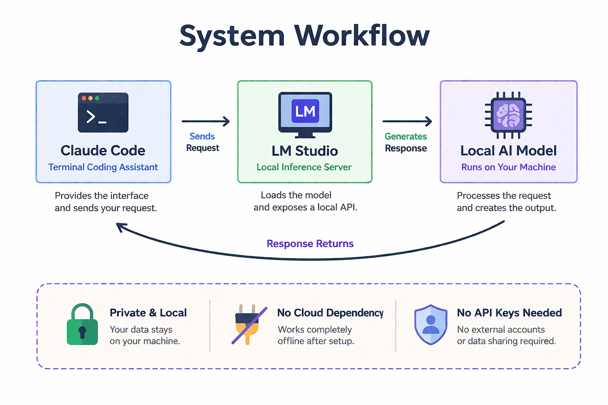

# Local Claude Code with LM Studio (Windows)

Educational notes and docs for running **Claude Code** against a **local LLM** served by **LM Studio**, with emphasis on architecture, context windows, and performance on CPU-first setups.

## Repository layout


| Path                                                                                                                               | Purpose                                                              |
| ---------------------------------------------------------------------------------------------------------------------------------- | -------------------------------------------------------------------- |
| [docs/architecture.md](docs/architecture.md)                                                                                       | Layers, models, GGUF/quantization, Claude Code vs Continue           |
| [docs/optimization.md](docs/optimization.md)                                                                                       | Context size, batching, timeouts, KV cache, `--tool none`, profiling |
| [docs/troubleshooting.md](docs/troubleshooting.md)                                                                                 | Context overflow, hidden prompt size, pitfalls                       |
| [examples/powershell-profile.ps1](examples/powershell-profile.ps1)                                                                 | Example env vars for local API (PowerShell)                          |
| [images/workflow-diagram.png](images/workflow-diagram.png)                                                                         | High-level data flow                                                 |
| [github_guide_claude_code_local_lm_studio_structured_learning.md](github_guide_claude_code_local_lm_studio_structured_learning.md) | Full single-file learning guide (source)                             |


## Quick mental model

```text
Claude Code → LM Studio (local HTTP API) → Local LLM → generated tokens → terminal
```

## Workflow diagram

<h2>Workflow Diagram</h2>
<p align="center">
  
</p>
<p align="center"><em>End-to-end local inference workflow using Claude Code, LM Studio, and a local language model.</em></p>

## Learning goals

- Understand why agent/tool workflows inflate prompt size (system + tool schemas + history).
- Set **context length** (`n_ctx`) above total prompt size (often **16k–32k** for tool use).
- Tune **timeouts** for slow CPU prompt ingestion.
- Choose **chat-style** vs **full agent** use based on latency needs.

## Prerequisites

- [LM Studio](https://lmstudio.ai/) with a loaded GGUF model and local server enabled.
- [Claude Code](https://www.anthropic.com/claude-code) configured to use your local base URL (see `examples/powershell-profile.ps1`).

## License

Content is provided for learning. Add a `LICENSE` file if you need a specific terms for your GitHub repo.